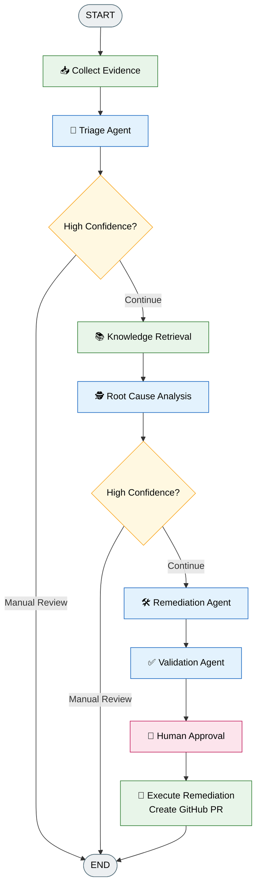
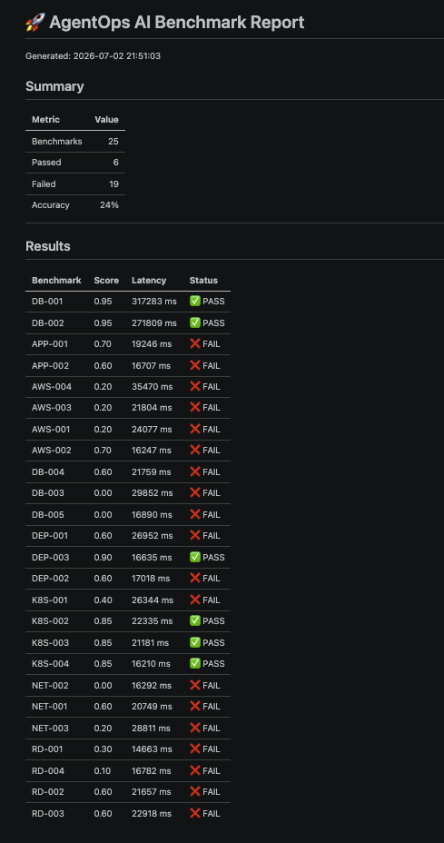
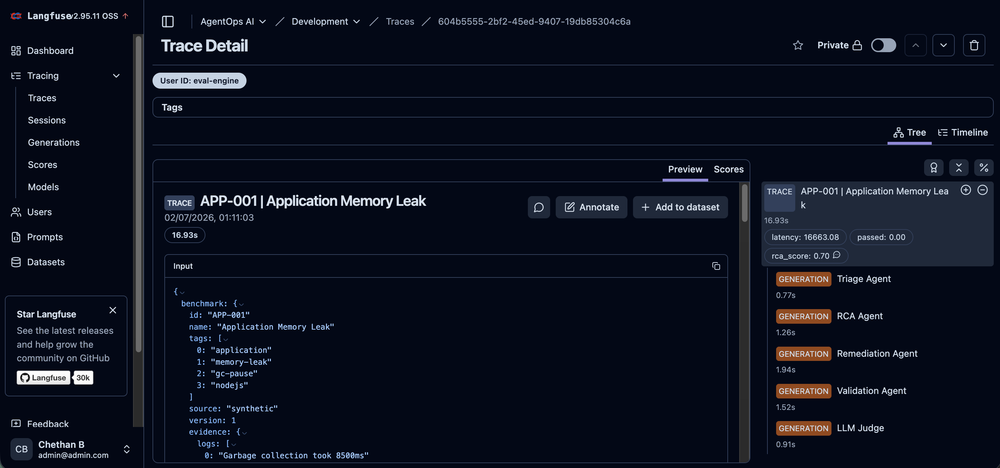
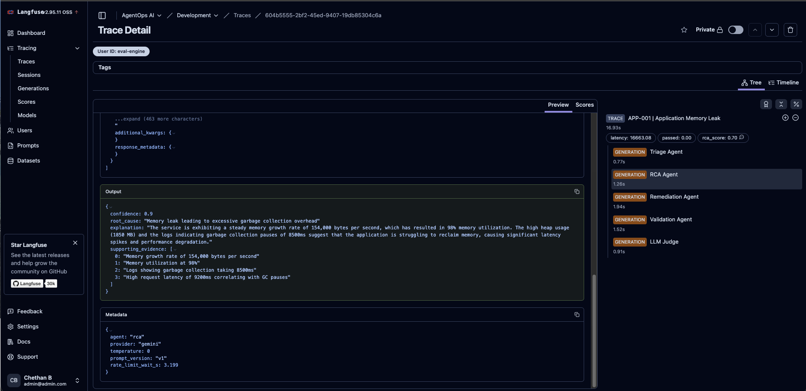
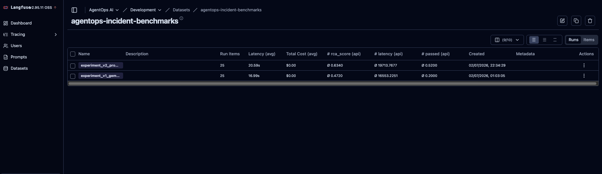
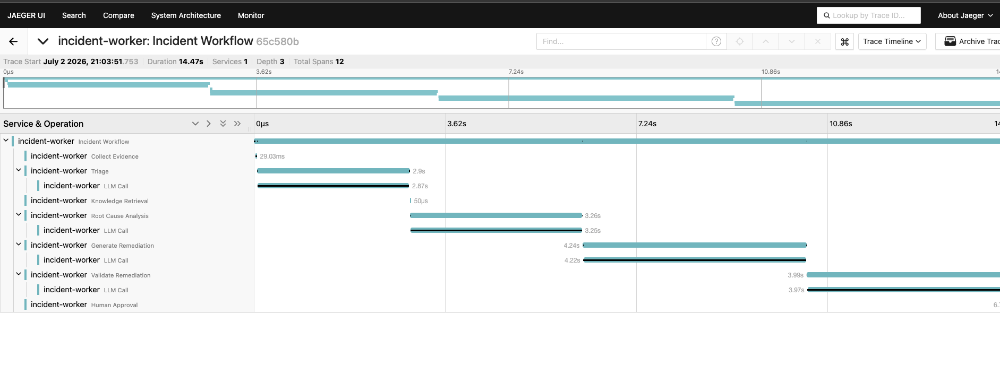
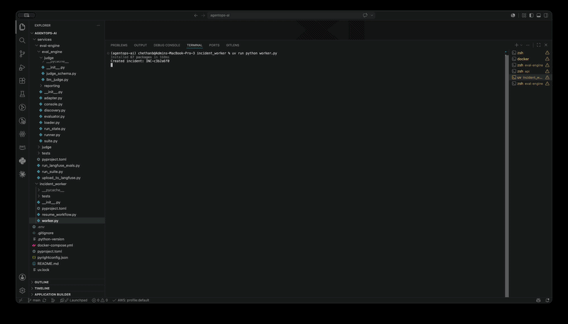

# 🤖 AgentOps AI

> **Production-Grade Autonomous Incident Response Platform built with LangGraph**

<p align="center">
Build autonomous AI systems that investigate infrastructure incidents end-to-end using a production-inspired multi-agent architecture.
</p>

<p align="center">
  
  
  
  
  
  
  
</p>

---

# 🚀 Overview

AgentOps AI is an end-to-end autonomous incident response platform
demonstrating modern AI engineering patterns.

Instead of building another chatbot, this project automates the
lifecycle of infrastructure incidents:

-   Receives AWS CloudWatch alarms
-   Collects evidence deterministically
-   Performs AI-powered triage
-   Retrieves historical knowledge (RAG)
-   Performs Root Cause Analysis
-   Generates remediation plans
-   Validates proposed fixes
-   Pauses for Human Approval
-   Creates GitHub Pull Requests
-   Evaluates itself using synthetic production benchmarks

---

## 🎯 Project Goals

This project was built to demonstrate production AI engineering patterns including:

- Event-driven architectures
- Multi-agent orchestration
- Retrieval-Augmented Generation
- Human-in-the-loop workflows
- AI observability
- Benchmark-driven evaluation

---

## 🚀 Key Features

- 🤖 Multi-Agent Incident Investigation
- 📚 Retrieval-Augmented Generation (RAG)
- 🔍 Deterministic Evidence Collection
- 👤 Human-in-the-Loop Approvals
- 🔀 Automated GitHub Pull Requests
- 📊 Langfuse Experiment Tracking
- 📡 OpenTelemetry + Jaeger Tracing
- 🧪 Benchmark Evaluation Framework

---

## 📈 Project Metrics

| Metric | Value |
|---------|------:|
| 🤖 AI Agents | 4 |
| 🔄 Workflow Nodes | 8 |
| 📊 Production Benchmarks | 25 |
| ☁️ AWS Services Simulated | 3 |
| 🔍 Observability Platforms | 2 |
| 🗄 Database | PostgreSQL + pgvector |

---

# ✨ Highlights

| Capability | Status |
|------------|:------:|
| 🤖 LangGraph Multi-Agent Workflow | ✅ |
| ☁️ AWS Event-Driven Architecture | ✅ |
| 👤 Human-in-the-Loop (HITL) | ✅ |
| 🔀 GitHub PR Automation | ✅ |
| 📡 OpenTelemetry Tracing | ✅ |
| 🟣 Langfuse LLM Observability | ✅ |
| 🏗️ Local AWS via LocalStack | ✅ |
| 📊 Evaluation Framework (25 Benchmarks) | ✅ |


---

# 🏗 Architecture

```mermaid
flowchart LR

%% ======================================================
%% AWS EVENT PIPELINE
%% ======================================================

subgraph AWS["☁️ AWS Infrastructure (LocalStack)"]
    CW["🚨 CloudWatch Alarm"]
    EB["📡 EventBridge"]
    SQS["📨 SQS Queue"]
end

Worker["⚙️ Incident Worker"]

%% ======================================================
%% CONTEXT COLLECTION
%% ======================================================

subgraph Context["🔍 Deterministic Context Collection"]
    Logs["📄 Logs Collector"]
    Metrics["📈 Metrics Collector"]
    Deployments["🚀 Deployments Collector"]
end

%% ======================================================
%% STORAGE
%% ======================================================

subgraph DB["🗄 PostgreSQL"]
    Incidents[("📋 Incidents")]
    Evidence[("📑 Incident Evidence")]
    Runbooks[("📚 Runbooks & Postmortems")]
    Checkpoints[("💾 Workflow Checkpoints")]
end

%% ======================================================
%% AI ORCHESTRATION
%% ======================================================

subgraph LangGraph["🧠 LangGraph Multi-Agent Workflow"]
    Triage["🤖 Triage"]
    Retrieval["📚 Knowledge Retrieval"]
    RCA["🕵️ Root Cause Analysis"]
    Remediation["🛠 Remediation"]
    Validation["✅ Validation"]
    HITL{"👤 Human Approval"}
    GitHub["🔀 GitHub PR"]
end

%% ======================================================
%% OBSERVABILITY
%% ======================================================

subgraph Observability["📊 Observability"]
    Langfuse["🟣 Langfuse"]
    OTel["📡 OpenTelemetry"]
    Jaeger["🔍 Jaeger"]
end

%% ======================================================
%% EVENT FLOW
%% ======================================================

CW --> EB
EB --> SQS
SQS --> Worker

%% ======================================================
%% CONTEXT COLLECTION
%% ======================================================

Worker --> Logs
Worker --> Metrics
Worker --> Deployments

Logs --> Evidence
Metrics --> Evidence
Deployments --> Evidence

Worker --> Incidents

%% ======================================================
%% KNOWLEDGE
%% ======================================================

Evidence --> Triage
Runbooks --> Retrieval
Triage --> Retrieval

%% ======================================================
%% AI WORKFLOW
%% ======================================================

Retrieval --> RCA
RCA --> Remediation
Remediation --> Validation
Validation --> HITL
HITL -->|Approved| GitHub

%% ======================================================
%% PERSISTENCE
%% ======================================================

LangGraph -. Checkpoints .-> Checkpoints

%% ======================================================
%% OBSERVABILITY
%% ======================================================

LangGraph -. LLM Traces .-> Langfuse
LangGraph -. OTEL Spans .-> OTel
OTel --> Jaeger

%% ======================================================
%% STYLES
%% ======================================================

classDef aws fill:#FFF3E0,stroke:#FB8C00,color:#000;
classDef worker fill:#E3F2FD,stroke:#1E88E5,color:#000;
classDef collector fill:#E8F5E9,stroke:#43A047,color:#000;
classDef storage fill:#F3E5F5,stroke:#8E24AA,color:#000;
classDef agent fill:#E1F5FE,stroke:#039BE5,color:#000;
classDef approval fill:#FCE4EC,stroke:#D81B60,color:#000;
classDef observability fill:#ECEFF1,stroke:#546E7A,color:#000;

class CW,EB,SQS aws;
class Worker worker;
class Logs,Metrics,Deployments collector;
class Incidents,Evidence,Runbooks,Checkpoints storage;
class Triage,Retrieval,RCA,Remediation,Validation,GitHub agent;
class HITL approval;
class Langfuse,OTel,Jaeger observability;
```

<!--  -->


---

## 🧠 LangGraph Workflow


---

## 📊 Evaluation

> 💡 During development, iterative prompt engineering and evaluation improved benchmark accuracy from **20% (5/25)** to **52% (13/25)** while producing more specific, component-level root cause analyses.

Current Evaluation Suite

- ✅ 25 Synthetic Production Incidents
- ✅ LLM-as-a-Judge Evaluation
- ✅ Langfuse Experiments
- ✅ Root Cause Accuracy
- ✅ Automated Benchmark Runner

Incident Categories

- Kubernetes
- PostgreSQL
- Redis
- AWS
- Networking
- Application Failures




---

## 🔭 Observability

### Langfuse







### Jaeger



---

## 🎥 Demo



# 🛠 Tech Stack

| Layer | Technology |
|-------|------------|
| Agent Framework | LangGraph |
| LLM | Ollama (Qwen3 8B) |
| Backend | FastAPI |
| Database | PostgreSQL + pgvector |
| Queue | EventBridge + SQS |
| Infrastructure | Docker + LocalStack |
| Observability | Langfuse + OpenTelemetry + Jaeger |
| Evaluation | Langfuse Experiments |

---

# 📁 Repository Structure

``` text
agentops-ai/
├── apps/
│   └── api/
├── services/
│   ├── incident-worker/
│   └── eval-engine/
├── packages/
│   ├── agents/
│   ├── workflows/
│   └── shared/
├── datasets/
│   └── benchmarks/
├── infra/
├── docs/
└── reports/
```

---

# 🚀 Getting Started

``` bash
docker compose up -d

uv sync

bash infra/bootstrap/create_resources.sh

bash aws --endpoint-url=http://localhost:4566 \
    events put-events \
    --entries file://infra/bootstrap/sample_alarm_event.json

uv run python services/incident_worker/worker.py

uv run uvicorn apps.api.main:app --reload
```

---

# 📈 What This Project Demonstrates

-   Multi-Agent AI Systems
-   LangGraph Orchestration
-   Retrieval-Augmented Generation (RAG)
-   Human-in-the-Loop Workflows
-   AI Observability
-   Event-Driven Architecture
-   Evaluation Frameworks
-   Production-inspired Backend Engineering

---

# 🔮 Production Roadmap

- [ ] Dynamic pgvector Retrieval
- [ ] Real CloudWatch Integration
- [ ] Kubernetes Deployment
- [ ] Cost Guardrails
- [ ] Slack Notifications
- [ ] CI Benchmark Regression Tests

---

Built to demonstrate modern AI Engineering, Multi-Agent Systems, and Production AI Infrastructure.