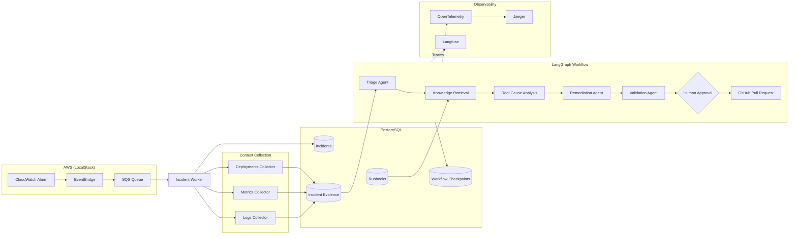

# 🤖 AgentOps AI

> **Production-Grade Autonomous Incident Response Platform built with LangGraph**

<p align="center">
Build autonomous AI systems that investigate infrastructure incidents end-to-end using a production-inspired multi-agent architecture.
</p>

<p align="center">
  
  
  
  
  
  
  
</p>

------------------------------------------------------------------------

# 🚀 Overview

AgentOps AI is an end-to-end autonomous incident response platform
demonstrating modern AI engineering patterns.

Instead of building another chatbot, this project automates the
lifecycle of infrastructure incidents:

-   Receives AWS CloudWatch alarms
-   Collects evidence deterministically
-   Performs AI-powered triage
-   Retrieves historical knowledge (RAG)
-   Performs Root Cause Analysis
-   Generates remediation plans
-   Validates proposed fixes
-   Pauses for Human Approval
-   Creates GitHub Pull Requests
-   Evaluates itself using synthetic production benchmarks

------------------------------------------------------------------------

# ✨ Highlights

  Capability                             Status
  -------------------------------------- --------
  LangGraph Multi-Agent Workflow         ✅
  AWS Event-Driven Architecture          ✅
  Human-in-the-Loop                      ✅
  GitHub PR Automation                   ✅
  OpenTelemetry Tracing                  ✅
  Langfuse LLM Observability             ✅
  Local AWS via LocalStack               ✅
  Evaluation Framework (25 Benchmarks)   ✅

------------------------------------------------------------------------

# 🏗 Architecture

<!--  -->


---

## 🧠 LangGraph Workflow


---

## 📊 Evaluation


---

## 🔭 Observability

### Langfuse


### Jaeger


---

## 🎥 Demo


------------------------------------------------------------------------

# 🧠 LangGraph Workflow

1.  Evidence Collection
2.  Incident Triage
3.  Knowledge Retrieval (RAG)
4.  Root Cause Analysis
5.  Remediation Planning
6.  Validation
7.  Human Approval
8.  GitHub Pull Request Creation

------------------------------------------------------------------------

# 📊 Evaluation

The project includes a production-style evaluation framework.

-   25 synthetic production incidents
-   LLM-as-a-Judge evaluation
-   Langfuse Experiments
-   Root Cause Accuracy scoring
-   Detailed benchmark reports

Current benchmark coverage includes:

-   Kubernetes
-   PostgreSQL
-   Redis
-   AWS
-   Networking
-   Application failures

------------------------------------------------------------------------

# 🔭 Observability

Every workflow execution is fully observable.

-   Langfuse traces
-   Prompt & response logging
-   Token usage
-   Agent latency
-   OpenTelemetry spans
-   Jaeger distributed tracing

------------------------------------------------------------------------

# 🛠 Tech Stack

  Category          Technology
  ----------------- -----------------------------------
  Agent Framework   LangGraph
  LLM               Ollama (Qwen3 8B)
  Backend           FastAPI
  Queue             SQS + EventBridge
  Database          PostgreSQL + pgvector
  Observability     Langfuse + OpenTelemetry + Jaeger
  Infrastructure    Docker + LocalStack
  Evaluation        Langfuse Experiments

------------------------------------------------------------------------

# 📁 Repository Structure

``` text
apps/
services/
packages/
datasets/
infra/
docs/
reports/
```

------------------------------------------------------------------------

# 🚀 Getting Started

``` bash
docker compose up -d

uv sync

bash infra/bootstrap/create_resources.sh

uv run python services/incident_worker/worker.py
```

------------------------------------------------------------------------

# 📈 What This Project Demonstrates

-   Multi-Agent AI Systems
-   LangGraph Orchestration
-   Retrieval-Augmented Generation (RAG)
-   Human-in-the-Loop Workflows
-   AI Observability
-   Event-Driven Architecture
-   Evaluation Frameworks
-   Production-inspired Backend Engineering

------------------------------------------------------------------------

# 🔮 Production Roadmap

-   Real CloudWatch integrations
-   Dynamic pgvector retrieval
-   CI benchmark regression testing
-   Cost guardrails
-   Kubernetes deployment
-   Slack integration

------------------------------------------------------------------------

# 📄 License

MIT
